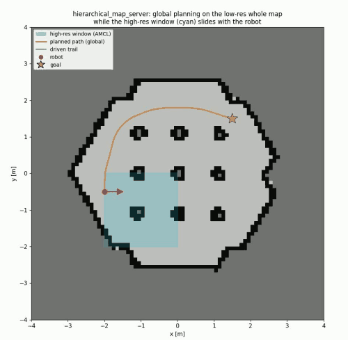

# hierarchical_map_server (monorepo)

A monorepo of **multi-resolution tiled map** packages for navigating a large area
(e.g. 500m x 500m @0.05m) with Nav2 + AMCL on ROS 2 Jazzy.

By managing the wide-area map as a grid of tiles and dynamically loading and
publishing only the region around the robot, a large area can be driven without
holding the whole map in memory.

## Demo



A driving demo in TurtleBot3 Gazebo. The global planner plans over the
**low-resolution whole-area map** (for the global costmap) while the
**high-resolution window** (cyan box, for AMCL) follows the robot and slides.
The global path (orange) extends across the whole area beyond the high-resolution
window, showing that **planning is done over the whole area, not bound by the
window** (the key point of design 3). Video version:
[`docs/hier_demo.mp4`](docs/hier_demo.mp4).

## Packages

| Package | Role |
|---|---|
| [`tile_map_server`](tile_map_server/) | Sliding-window map server that stitches and publishes high-resolution tiles around the robot (for AMCL and the costmap) |
| [`hierarchical_map_server`](hierarchical_map_server/) | Generates a low-resolution whole-area map from the tiles and feeds it to the global costmap, enabling whole-area planning to goals outside the high-resolution window (depends on `tile_map_server`) |

The dependency is `hierarchical_map_server` → `tile_map_server`.
`hierarchical_map_server` reuses `tile_map_server`'s core library (tileset loading,
PGM loader). See each directory's README for package details and architecture
diagrams.

## Design overview

- **tile_map_server (sliding window)**: stitches the `N x N` tiles centered on the
  robot into a single `OccupancyGrid` and publishes it on `/map`
  (transient_local). It recenters the window when the robot crosses a tile
  boundary. Since all tiles share a single global origin, AMCL's self-localization
  stays continuous even when the window switches.
- **hierarchical_map_server (hierarchical map)**: downsamples all tiles at startup
  to generate a single low-resolution whole-area map and publishes it on
  `/map_global_lowres`. The global costmap plans over the whole area with it, the
  high-resolution window is AMCL-only, and precise obstacle avoidance is handled by
  the local costmap (/scan) — a dual-costmap configuration.

## Build

```bash
# Example: clone under a colcon workspace's src/
mkdir -p ~/nav_ws/src && cd ~/nav_ws/src
git clone https://github.com/atinfinity/hierarchical_map_server.git
cd ~/nav_ws
colcon build
source install/setup.bash
```

colcon resolves the build order (`tile_map_server` → `hierarchical_map_server`)
automatically.

## Tests

```bash
colcon test --packages-select tile_map_server hierarchical_map_server
colcon test-result --verbose
```

- `tile_map_server`: unit tests (tile index, hysteresis, stitching, cache)
- `hierarchical_map_server`: unit tests (downsampling, whole-area assembly)
- Both packages include a TurtleBot3 Gazebo integrated driving test launch.

## Target environment

- ROS 2 Jazzy
- Nav2 (amcl / costmap_2d / planner)
- Verified with: TurtleBot3 (Gazebo / gz sim)

## License

Apache-2.0
