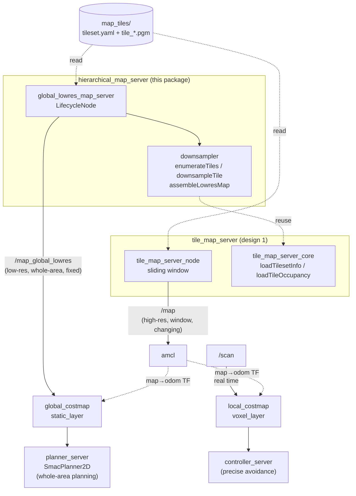
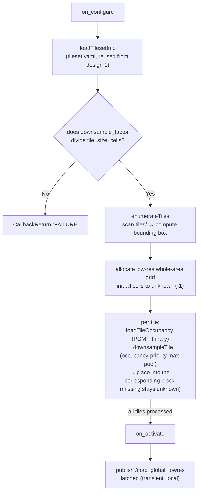

# hierarchical_map_server

A package for large-area Nav2 navigation using a **multi-resolution (hierarchical)
map** (design 3). It sits on top of `tile_map_server` (design 1) and makes it
possible to **plan a whole-area path even to goals outside the high-resolution
sliding window**.

## Problem and solution

With `tile_map_server` alone (design 1), the global costmap sees only the
high-resolution window around the robot, so it **cannot plan a global path to a
goal outside the window and returns `ABORTED`**.

This package **generates a single low-resolution whole-area map** from the tile
set and feeds it to the global costmap. The high-resolution window is dedicated
to AMCL (self-localization), separating roles by resolution.

| Map | Resolution | Extent | Provided by | Consumed by |
|---|---|---|---|---|
| High-res sliding window | 0.05m | Around the robot (6m+) | tile_map_server (design 1) | amcl |
| Low-res whole-area map | 0.1-0.2m | Entire area (single map) | **this package** | global_costmap.static_layer |
| Real-time obstacles | 0.05m | Rolling window | /scan | local_costmap |

The high-resolution window is kept for AMCL because handing a 500m x 500m @0.05m
map (100M cells) to AMCL as a single map makes likelihood-field construction
impractical. Bounding it with the window keeps AMCL's load bounded.

## Architecture

### Overall structure (dual costmap and role separation)

From the same tile set, `tile_map_server` (design 1) provides the high-resolution
sliding window and this package provides the low-resolution whole-area map. The
global costmap plans over the whole-area map, the high-resolution window is
AMCL-only, and precise obstacle avoidance is handled by the local costmap (/scan).



### Low-res map generation flow at startup

`global_lowres_map_server` assembles a single low-resolution whole-area map from
the tiles in `on_configure` and publishes it latched in `on_activate`
(generation happens only once at startup; it is fixed afterward).



Because processing is done one tile at a time, peak memory stays within
"low-res whole-area grid + one tile" (all tiles are never loaded into RAM at once).

## Node `global_lowres_map_server`

A LifecycleNode that reads the same tileset.yaml as `tile_map_server` and, **at
startup, downsamples all tiles to assemble a single low-resolution whole-area
OccupancyGrid and publishes it latched on `/map_global_lowres`**. There is no need
to manually prepare or keep a separate low-resolution map file in sync
(the tiles are the single source of truth).

### Conservative downsampling

Each low-resolution cell is decided from a `downsample_factor²` high-resolution
block using **occupancy priority** (occupied > free > unknown). If the block
contains even one occupied cell it becomes occupied. This ensures that
**thin walls are not lost by averaging** and the planner does not cut through
walls (error only ever toward the safe/thicker side).

### Parameters

| Parameter | Default | Description |
|---|---|---|
| `tileset_path` | (required) | tileset.yaml from design 1 |
| `downsample_factor` | 2 | Downsample factor (divisor of tile_size_cells). 0.05→0.1m with factor 2, 0.2m with factor 4 |
| `occupancy_priority` | true | Conservative max-pool (occupancy priority). Majority vote if false |
| `topic_name` | map_global_lowres | Published topic |
| `global_frame` | map | frame_id |

## Usage

No preparation is required since the node generates the low-resolution map from
the tiles automatically.

### Reusable localization module (amcl configuration)

```bash
ros2 launch hierarchical_map_server hierarchical_localization.launch.py \
  tileset_path:=/path/to/map_tiles/tileset.yaml use_sim_time:=true
# -> tile_map_server(/map) + global_lowres_map_server(/map_global_lowres) + amcl
# launch navigation with nav2_hierarchical_params.yaml
ros2 launch nav2_bringup navigation_launch.py \
  params_file:=$(ros2 pkg prefix hierarchical_map_server)/share/hierarchical_map_server/config/nav2_hierarchical_params.yaml
```

### Nav2 parameters (`config/nav2_hierarchical_params.yaml`)

Auto-generated by modifying `nav2_bringup/nav2_params.yaml`. Key points:

- **amcl**: `first_map_only: false`, `map_topic: map` (high-res window)
- **global_costmap**: `resolution: 0.1`, `plugins: [static_layer, inflation_layer]`,
  `static_layer.map_topic: /map_global_lowres` (**absolute topic name, to avoid
  namespace prefixing**)
- **planner**: `SmacPlanner2D` (an A* that scales well to a large low-res costmap)
- **local_costmap**: unchanged (/scan-based rolling window)

## Offline generation tool (optional)

Normally unnecessary since the node generates the map automatically. Use it when
you want to visually inspect the map or serve it with the stock nav2_map_server
(same occupancy-priority max-pool as the node):

```bash
ros2 run hierarchical_map_server make_lowres_map.py \
  --tileset map_tiles/tileset.yaml --factor 4 --out lowres
# -> lowres.pgm + lowres.yaml (map_server-compatible)
```

## Scale and performance (500m x 500m @0.05m)

- Low-res @0.2m (factor 4): 2500 x 2500 = 6.25M cells ≈ 6.25MB. Holds the whole
  area as a single map.
- Startup generation: reads and downsamples up to 100 tiles (~100MB) once → a few
  seconds (one-time). Peak memory is "low-res whole area + one tile"; all tiles
  are never loaded into RAM at once.
- **Planner**: for 6.25M cells, Dijkstra-based NavFn is heavy. SmacPlanner2D /
  ThetaStar are recommended.
- For 1km²-scale areas, raise the factor (0.25-0.5m) or make the low-res side a
  sliding window too (room for extension).

## Tests

### Unit tests

```bash
colcon build --packages-select hierarchical_map_server
colcon test --packages-select hierarchical_map_server && colcon test-result --verbose
# test_downsampler: occupancy-priority rule, unknown propagation, dimensions
# test_assemble  : assembly from sparse tiles, origin, missing blocks
```

### TurtleBot3 Gazebo integrated driving test (ground-truth localization version)

Uses the tb3_sandbox tiles bundled with design 1 and verifies driving in the
dual-costmap configuration. Because amcl has an environment-dependent pf_kdtree
crash, self-localization is provided via a ground-truth map→odom
(for the amcl configuration, see `hierarchical_localization.launch.py`).

```bash
# Terminal 1: Gazebo + dual-costmap Nav2 + hierarchical map (headless)
ros2 launch hierarchical_map_server tb3_hierarchical_groundtruth_sim.launch.py headless:=True
# Terminal 2: cross-arena drive
ros2 run tile_map_server drive_across_boundary.py 1.5 1.5
```

Expected result (measured):

```
global_lowres_map_server: Built low-res map: 80 x 80 @ 0.100 m/cell (8.0 x 8.0 m) from 12 tiles
global costmap size: 80 x 80        # <- uses the low-res whole area (8m), not the high-res window (6m)
  tile window recenter -> origin (-4.0, -4.0) (120x120)   # the high-res window slides at 6m
  tile window recenter -> origin (-4.0, -2.0) (120x120)
  tile window recenter -> origin (-2.0, -2.0) (120x120)
navigation status=4 (SUCCEEDED)
```

The **global costmap stays 80 x 80 (8m whole area)** while the **high-resolution
window (120 x 120 = 6m) slides as the robot drives**. The two layers operate in
parallel at their respective scopes, and global planning is done on the
whole-area map decoupled from the high-resolution window (the key point of
design 3).

## Dependencies

Reuses the core library of `tile_map_server` (design 1): `loadTilesetInfo` /
`loadTileOccupancy` / `TilesetInfo`. PGM loading, trinary conversion, and the tile
coordinate convention are shared to avoid duplicate implementations and
convention drift.
