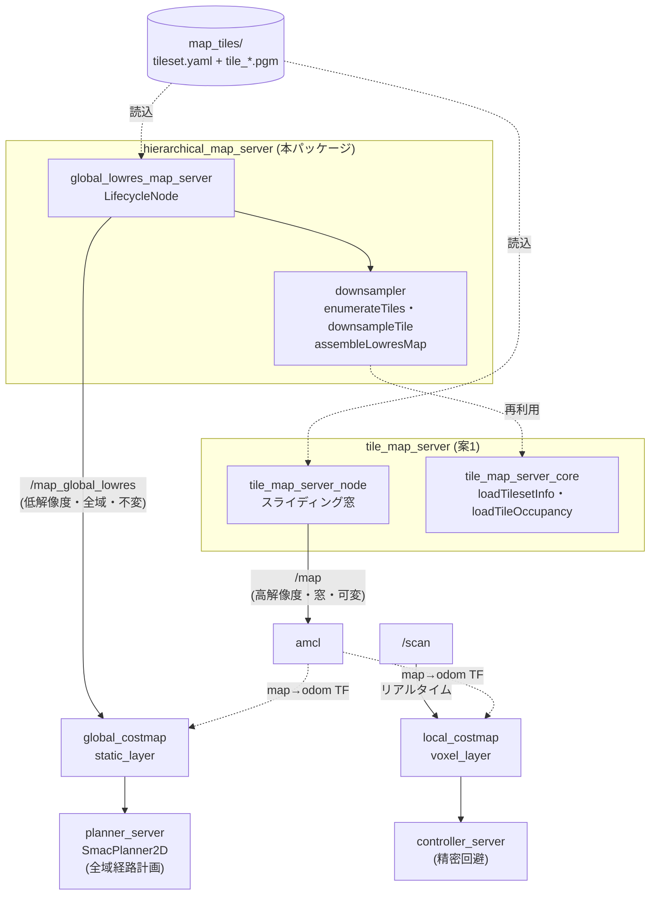
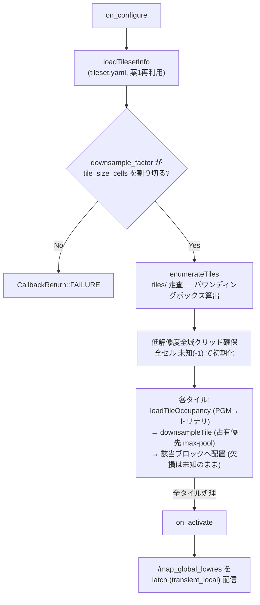

# hierarchical_map_server

広域エリアのNav2ナビゲーションを、**多重解像度(階層)地図**で行うためのパッケージ
(案3)。`tile_map_server`(案1)の上に載せる構成で、**高解像度スライディング窓の
外にあるゴールへも全域経路を計画できる**ようにする。

## 課題と解決

`tile_map_server` 単体(案1)では、global costmap が現在地周辺の高解像度窓だけを
見るため、**窓の外にあるゴールにグローバル経路を引けず `ABORTED`** になる。

本パッケージは、タイル集合から**低解像度の全域地図を1枚生成**して global costmap に
供給する。高解像度窓は AMCL(自己位置推定)専用にし、役割を解像度で分離する。

| 地図 | 解像度 | 範囲 | 提供元 | 消費先 |
|---|---|---|---|---|
| 高解像度スライディング窓 | 0.05m | 現在地周辺(6m〜) | tile_map_server(案1) | amcl |
| 低解像度全域地図 | 0.1〜0.2m | 全エリア(一枚) | **本パッケージ** | global_costmap.static_layer |
| リアルタイム障害物 | 0.05m | ローリング窓 | /scan | local_costmap |

高解像度窓を AMCL 用に残すのは、500m四方 @0.05m(1億セル)を一枚で AMCL に渡すと
尤度場構築が非現実的なため。窓で境界を絞り AMCL の負荷を有界に保つ。

## アーキテクチャ

### 全体構成(二重costmapと役割分離)

同じタイル集合を情報源に、`tile_map_server`(案1)が高解像度スライディング窓を、
本パッケージが低解像度の全域地図を提供する。global costmap は全域地図で計画し、
高解像度窓は AMCL 専用、精密な障害物回避は local costmap(/scan)が担う。



### 起動時の低解像度地図生成フロー

`global_lowres_map_server` は `on_configure` でタイルから低解像度全域地図を1枚
組み立て、`on_activate` で latch 配信する(生成は起動時1回のみ。以降は不変)。



処理はタイル1枚ずつ行うため、ピークメモリは「低解像度全域グリッド + タイル1枚」に
収まる(全タイルを同時にRAMへ載せない)。

## ノード `global_lowres_map_server`

`tile_map_server` と同じ tileset.yaml を読み、**起動時に全タイルをダウンサンプルして
低解像度の全域 OccupancyGrid を1枚組み立て、latch で `/map_global_lowres` に配信**する
LifecycleNode。別途の低解像度地図ファイルを手作業で用意・同期する必要がない
(タイルが唯一の真実の情報源)。

### 保守的ダウンサンプリング

低解像度1セルは高解像度 `downsample_factor²` ブロックから **占有優先**で決定する
(占有 > 自由 > 未知)。ブロック内に占有が1つでもあれば占有。これにより
**細い壁が平均化で消えず**、プランナーが壁を突き抜けない(安全側に太る方向にのみ誤差)。

### パラメータ

| パラメータ | 既定 | 説明 |
|---|---|---|
| `tileset_path` | (必須) | 案1のtileset.yaml |
| `downsample_factor` | 2 | 低解像度化係数(tile_size_cellsの約数)。0.05→factor2で0.1m, factor4で0.2m |
| `occupancy_priority` | true | 保守的max-pool(占有優先)。falseで多数決 |
| `topic_name` | map_global_lowres | 配信トピック |
| `global_frame` | map | frame_id |

## 使い方

低解像度地図はノードがタイルから自動生成するため事前準備は不要。

### 再利用可能なlocalizationモジュール(amcl構成)

```bash
ros2 launch hierarchical_map_server hierarchical_localization.launch.py \
  tileset_path:=/path/to/map_tiles/tileset.yaml use_sim_time:=true
# → tile_map_server(/map) + global_lowres_map_server(/map_global_lowres) + amcl
# navigation は nav2_hierarchical_params.yaml で起動する
ros2 launch nav2_bringup navigation_launch.py \
  params_file:=$(ros2 pkg prefix hierarchical_map_server)/share/hierarchical_map_server/config/nav2_hierarchical_params.yaml
```

### Nav2 パラメータ(`config/nav2_hierarchical_params.yaml`)

`nav2_bringup/nav2_params.yaml` を自動改変したもの。要点:

- **amcl**: `first_map_only: false`, `map_topic: map`(高解像度窓)
- **global_costmap**: `resolution: 0.1`, `plugins: [static_layer, inflation_layer]`,
  `static_layer.map_topic: /map_global_lowres`(**絶対トピック名。名前空間付与を防ぐ**)
- **planner**: `SmacPlanner2D`(大規模低解像度costmapに強いA*)
- **local_costmap**: 変更なし(/scanベースのローリング窓)

## オフライン生成ツール(任意)

通常はノードが自動生成するため不要。地図の目視確認や stock nav2_map_server で
配信したい場合に使う(ノードと同じ占有優先max-pool):

```bash
ros2 run hierarchical_map_server make_lowres_map.py \
  --tileset map_tiles/tileset.yaml --factor 4 --out lowres
# → lowres.pgm + lowres.yaml (map_server互換)
```

## 規模とパフォーマンス(500m×500m @0.05m)

- 低解像度 @0.2m(factor 4): 2500×2500 = 6.25M セル ≈ 6.25MB。全域を一枚で保持。
- 起動時生成: 最大100タイル(約100MB)を1回読込・縮小 → 数秒(一度きり)。ピークメモリは
  「低解像度全域 + タイル1枚」。全タイルを同時にRAMに載せない。
- **プランナ**: 6.25MセルではDijkstra系のNavFnは重い。SmacPlanner2D/ThetaStar推奨。
- 1km²級では factor を上げる(0.25〜0.5m)か、低解像度側もスライディング窓化(拡張余地)。

## テスト

### 単体テスト

```bash
colcon build --packages-select hierarchical_map_server
colcon test --packages-select hierarchical_map_server && colcon test-result --verbose
# test_downsampler: 占有優先ルール・未知伝播・寸法
# test_assemble  : 疎タイルからの組み立て・origin・欠損ブロック
```

### TurtleBot3 Gazebo 結合走行テスト(完全自己位置版)

案1同梱の tb3_sandbox タイルを使い、二重costmap構成で走行検証する。amcl は
環境依存の pf_kdtree クラッシュがあるため、真値 map→odom で自己位置を与える
(amcl構成は `hierarchical_localization.launch.py`)。

```bash
# 端末1: Gazebo + 二重costmap Nav2 + 階層地図(ヘッドレス)
ros2 launch hierarchical_map_server tb3_hierarchical_groundtruth_sim.launch.py headless:=True
# 端末2: クロスアリーナ走行
ros2 run tile_map_server drive_across_boundary.py 1.5 1.5
```

期待結果(実測):

```
global_lowres_map_server: Built low-res map: 80 x 80 @ 0.100 m/cell (8.0 x 8.0 m) from 12 tiles
global costmap size: 80 x 80        # ← 高解像度窓(6m)ではなく低解像度全域(8m)を使用
  tile window recenter -> origin (-4.0, -4.0) (120x120)   # 高解像度窓は6mでスライド
  tile window recenter -> origin (-4.0, -2.0) (120x120)
  tile window recenter -> origin (-2.0, -2.0) (120x120)
navigation status=4 (SUCCEEDED)
```

**global costmap が 80×80(8m全域)**を維持したまま、**高解像度窓(120×120=6m)が
走行に伴いスライド**する。両層がそれぞれのスコープで並行動作し、グローバル計画は
高解像度窓と切り離された全域地図で行われる(案3の要点)。

## 依存

`tile_map_server`(案1)のコアライブラリ(`loadTilesetInfo` / `loadTileOccupancy` /
`TilesetInfo`)を再利用する。PGM読込・トリナリ変換・タイル座標規約を共有し、
二重実装と規約ズレを防ぐ。
