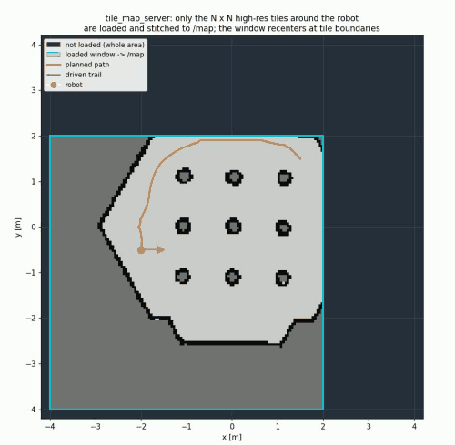
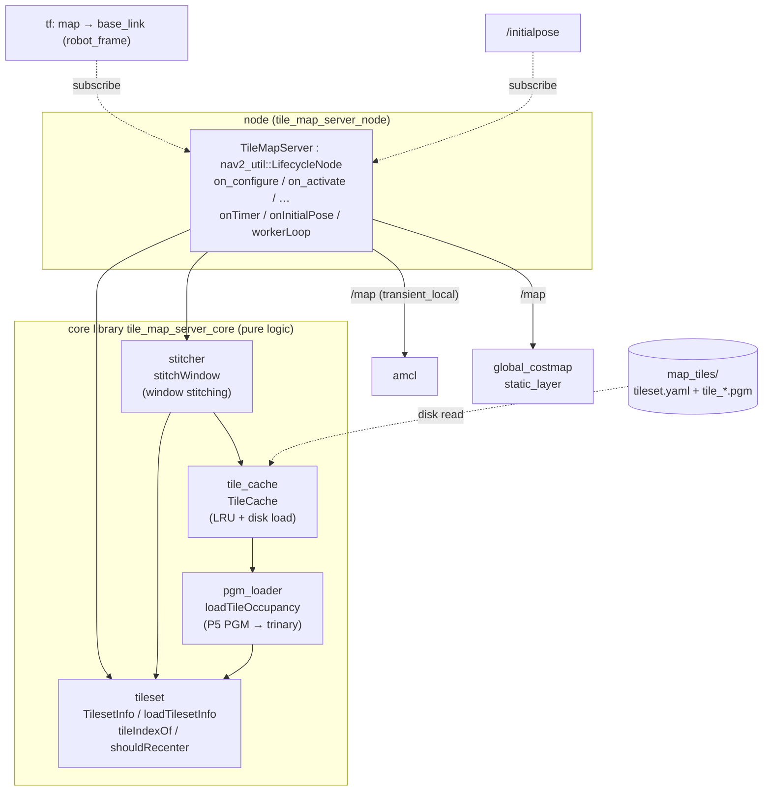
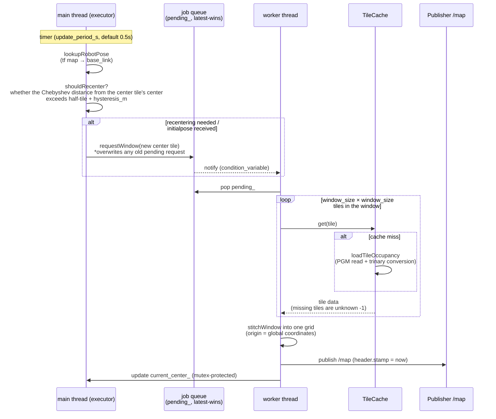

# tile_map_server

A sliding-window tiled map server for navigating a large area (e.g. 500m x 500m
@0.05m) with Nav2.

From a map that has been pre-split into a grid of tiles, it loads and stitches
only the `window_size` x `window_size` tiles centered on the robot's current
position (default 3 x 3 = 150m square) and publishes them on `/map`
(`transient_local`). Since all tiles share a single global origin, AMCL's
self-localization and the Nav2 costmap stay continuous even when the window
switches.

## Demo



A driving demo in TurtleBot3 Gazebo. Only the N x N tiles around the robot are
loaded and stitched at high resolution and published on `/map` (cyan box), while
**everything outside the window (the rest of the area) is not loaded**. When the
robot crosses a tile boundary the **window recenters and slides**, always keeping
only the neighborhood of the current position in memory. Video version:
[`docs/tms_demo.mp4`](docs/tms_demo.mp4).

If you need whole-area planning covered by a single map, see
[hierarchical_map_server](https://github.com/atinfinity/hierarchical_map_server)
(design 3), which additionally uses a low-resolution whole-area map.

## Architecture

### Module structure

The node-independent core logic is split into a static library
`tile_map_server_core` (the target of the unit tests, and reused by design 3),
and the LifecycleNode uses it.



### Processing flow (two-thread design)

The main thread (executor) monitors the robot position and decides on recentering,
while a worker thread handles the heavy tile loading, stitching, and publishing.
The job queue holds only the latest request (latest-wins); if a new request
arrives while loading, the old pending request is discarded.



Right after startup (before tf is available) it publishes the window at
`initial_window_center`; posting `/initialpose` in RViz immediately switches to
the window at that position (solving the chicken-and-egg problem).

## 1. Splitting the map

Split a map_server-format wide-area map (YAML + image) into tiles:

```bash
ros2 run tile_map_server split_map.py \
  --map /path/to/bigmap.yaml --tile-size-cells 1000 --out ~/maps/map_tiles
```

Output:

```
map_tiles/
├── tileset.yaml          # resolution, tile size, global origin
└── tiles/
    └── tile_{ix}_{iy}.pgm  # fully-unknown tiles are not written
```

For 500m x 500m @0.05m with 1000-cell tiles (50m), you get at most
10 x 10 = 100 tiles (~1MB each).

## 2. Launch

```bash
ros2 launch tile_map_server tile_map_server.launch.py \
  params_file:=/path/to/params.yaml
```

See `config/tile_map_server_params.yaml` for parameters (set `tileset_path` to the
absolute path of `tileset.yaml`).

To integrate into a Nav2 bringup, replace `map_server` with
`tile_map_server_node` and set the `node_names` of
`lifecycle_manager_localization` to `[tile_map_server, amcl]`.

## 3. Required AMCL / Nav2 settings

See `config/nav2_localization_example.yaml`. Key points:

- **amcl**: `first_map_only: false` (accept map updates; without it, the window
  switch is not followed)
- **global_costmap/static_layer**: `map_subscribe_transient_local: true`

## 4. Behavior

- At 2Hz (`update_period_s`) it monitors the tf `map -> base_link`, and when the
  Chebyshev distance from the current center tile's center exceeds
  "half-tile + `hysteresis_m`", the worker thread stitches and republishes a new
  window (about once per 50m of travel).
- Tiles are LRU-cached; a one-step window move loads at most `window_size` new
  tiles from disk.
- Before tf is available (right after startup) it publishes the window at
  `initial_window_center`, and posting `/initialpose` in RViz immediately switches
  to the window at that position.
- Missing tile regions are published as unknown (-1).

## 5. Known limitations / notes

- A yaw-rotated map origin is not supported (the split tool errors out).
- AMCL rebuilds the likelihood field on every map update (a few hundred ms for a
  3 x 3 window / 9M cells). If this is too long on real hardware, tune
  `window_size`, the tile size, or `laser_likelihood_max_dist`.
- If the goal is outside the window, the global planner cannot plan a path. For
  long distances, split it into waypoints inside the window using a waypoint
  follower / `NavigateThroughPoses`.

## Tests

### Unit tests

```bash
colcon build --packages-select tile_map_server
colcon test --packages-select tile_map_server && colcon test-result --verbose
```

### TurtleBot3 Gazebo integrated driving test

Splits the stock Nav2 tb3_sandbox map into 2m tiles and drives TurtleBot3
(Gazebo / gz sim) with Nav2 across tile boundaries, verifying tile_map_server's
window recentering and the global costmap's consumption of it.

The build bundles `maps/tb3_sandbox_tiles/` in the repository; to create it
yourself:

```bash
ros2 run tile_map_server split_map.py \
  --map $(ros2 pkg prefix nav2_bringup)/share/nav2_bringup/maps/tb3_sandbox.yaml \
  --tile-size-cells 40 --out maps/tb3_sandbox_tiles
```

Two integration launches are provided:

| launch | localization | purpose |
|---|---|---|
| `tb3_tile_nav_sim.launch.py` | **amcl** | The intended configuration. Evaluates AMCL self-localization continuity |
| `tb3_tile_groundtruth_sim.launch.py` | Gazebo ground truth (static map→odom) | Verifies driving / recentering / costmap consumption without amcl |

```bash
# Terminal 1: launch simulation + Nav2 + tile_map_server (headless)
ros2 launch tile_map_server tb3_tile_groundtruth_sim.launch.py headless:=True
# Terminal 2: drive to a boundary-crossing goal inside the window (keep the goal inside the current window)
ros2 run tile_map_server drive_across_boundary.py -1.5 -1.5
```

Expected result (measured): during the drive, the `/map` window origin
transitions several times (recentering at boundary crossings), each time
triggering `global_costmap StaticLayer: Resizing costmap` to update the costmap,
and navigation completes with `status=4 (SUCCEEDED)`.

```
tile window recenter -> origin (-2.0, -2.0) (120x120)
tile window recenter -> origin (-2.0, -4.0) (120x120)
tile window recenter -> origin (-4.0, -4.0) (120x120)
navigation status=4 (4=SUCCEEDED)
distinct tile windows during drive: 3
RESULT: PASS
```

**Keep the goal inside the currently loaded tile window.** A goal outside the
window cannot be planned by the global planner and results in `ABORTED` (a known
limitation; see "goal outside the window").

#### Note on the AMCL configuration

`tb3_tile_nav_sim.launch.py` (amcl configuration) wires tile_map_server correctly
into Nav2's `lifecycle_manager_localization` alongside amcl, and tile_map_server
configures/activates and publishes tile windows without issue (integration
verified; amcl accepts the stitched maps normally).

However, in some environments `nav2_amcl` has a known upstream bug where it
crashes with `pf_kdtree.c: pf_kdtree_cluster: Assertion` under the heavy load of
all nodes starting simultaneously (unrelated to tile_map_server; confirmed that
neither stock map_server + amcl nor tile_map_server + amcl alone crashes). This
launch mitigates it by delaying the navigation stack until after amcl starts and
adding `respawn` to amcl, but in environments where the crash reproduces, use the
ground-truth version `tb3_tile_groundtruth_sim.launch.py` to verify driving and
recentering.
