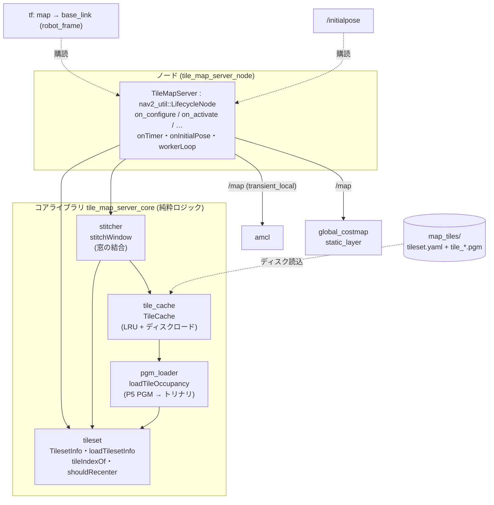
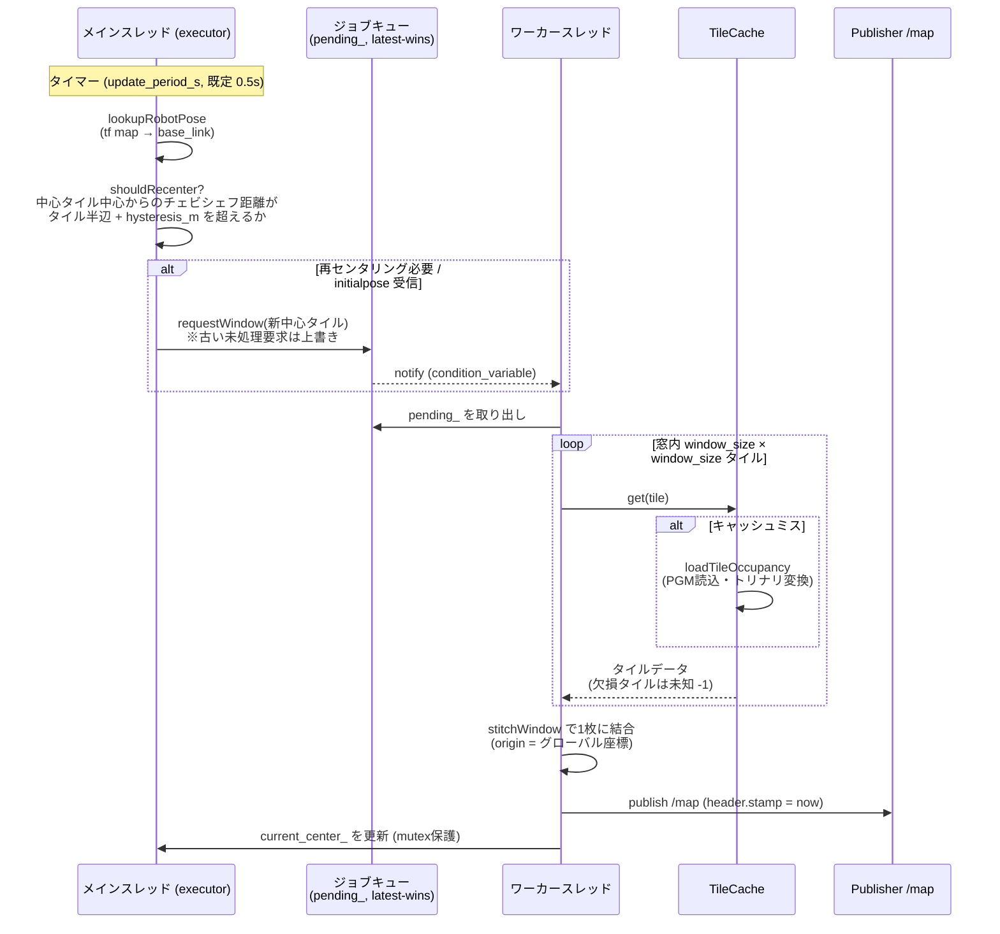

# tile_map_server

広域エリア(例: 500m×500m @0.05m)をNav2でナビゲーションするための、
スライディングウィンドウ方式タイル地図サーバ。

事前にグリッド分割した地図タイルのうち、ロボット現在位置を中心とする
`window_size`×`window_size` 枚(デフォルト3×3 = 150m四方)だけをロード・結合し、
`/map`(`transient_local`)に配信する。全タイルは単一のグローバル原点で座標系を
共有するため、窓が切り替わってもAMCLの自己位置推定とNav2のcostmapは連続する。

## アーキテクチャ

### モジュール構成

ノード非依存のコアロジックを静的ライブラリ `tile_map_server_core` に分離し
(単体テスト対象・案3から再利用)、LifecycleNode がそれを利用する。



### 処理の流れ(2スレッド構成)

メインスレッド(executor)がロボット位置を監視して再センタリングを判定し、
ワーカースレッドが重いタイルロード・結合・配信を担う。ジョブは最新1件のみ保持
(latest-wins)で、ロード中に新しい要求が来たら古い未処理要求は捨てる。



起動直後(tf未確立)は `initial_window_center` の窓を配信し、RVizで `/initialpose`
を打つと即座にその位置の窓へ切り替わる(鶏卵問題の解決)。

## 1. 地図の分割

map_server形式の広域地図(YAML + 画像)をタイルへ分割する:

```bash
ros2 run tile_map_server split_map.py \
  --map /path/to/bigmap.yaml --tile-size-cells 1000 --out ~/maps/map_tiles
```

出力:

```
map_tiles/
├── tileset.yaml          # 解像度・タイルサイズ・グローバル原点
└── tiles/
    └── tile_{ix}_{iy}.pgm  # 全面未知のタイルは出力されない
```

500m×500m @0.05m・タイル1000セル(50m)なら最大10×10=100タイル
(1タイル約1MB)になる。

## 2. 起動

```bash
ros2 launch tile_map_server tile_map_server.launch.py \
  params_file:=/path/to/params.yaml
```

パラメータは `config/tile_map_server_params.yaml` を参照
(`tileset_path` に `tileset.yaml` の絶対パスを設定する)。

Nav2 bringupに組み込む場合は `map_server` を `tile_map_server_node` に置き換え、
`lifecycle_manager_localization` の `node_names` を
`[tile_map_server, amcl]` にする。

## 3. AMCL / Nav2側の必須設定

`config/nav2_localization_example.yaml` 参照。要点:

- **amcl**: `first_map_only: false`(地図更新の受理。これがないと窓切替に追従しない)
- **global_costmap/static_layer**: `map_subscribe_transient_local: true`

## 4. 動作

- 2Hz(`update_period_s`)でtf `map -> base_link` を監視し、現在の中心タイルの
  中心からチェビシェフ距離で「タイル半辺 + `hysteresis_m`」を超えたら、
  ワーカースレッドが新しい窓を結合して再配信する(約50m走行ごとに1回)。
- タイルはLRUキャッシュされ、1ステップの窓移動での新規ディスクロードは
  `window_size` 枚のみ。
- tf確立前(起動直後)は `initial_window_center` の窓を配信し、RVizで
  `/initialpose` を打つと即座にその位置の窓へ切り替わる。
- 欠損タイル領域は未知(-1)として配信される。

## 5. 既知の制約・注意

- 地図原点のyaw回転は非対応(分割ツールがエラーにする)。
- AMCLは地図更新のたびに尤度場を再構築する(3×3窓・9Mセルで数百ms程度)。
  実機で長い場合は `window_size` かタイルサイズ、`laser_likelihood_max_dist`
  を調整する。
- ゴールが窓外にある場合グローバルプランナーは経路を引けない。長距離は
  waypoint follower / `NavigateThroughPoses` で窓内に収まる中継点に分割すること。

## テスト

### 単体テスト

```bash
colcon build --packages-select tile_map_server
colcon test --packages-select tile_map_server && colcon test-result --verbose
```

### TurtleBot3 Gazebo 結合走行テスト

Nav2標準の tb3_sandbox 地図を 2m タイルに分割し、TurtleBot3(Gazebo/gz sim)を
Nav2 で境界跨ぎナビゲーションさせて、tile_map_server の窓再センタリングと
global costmap の消費を検証する。

分割はビルド時にリポジトリ同梱の `maps/tb3_sandbox_tiles/` を使う(自作する場合):

```bash
ros2 run tile_map_server split_map.py \
  --map $(ros2 pkg prefix nav2_bringup)/share/nav2_bringup/maps/tb3_sandbox.yaml \
  --tile-size-cells 40 --out maps/tb3_sandbox_tiles
```

2つの結合launchを用意している:

| launch | 自己位置 | 用途 |
|---|---|---|
| `tb3_tile_nav_sim.launch.py` | **amcl** | 本来の構成。AMCLでの自己位置推定連続性を評価 |
| `tb3_tile_groundtruth_sim.launch.py` | Gazebo真値(静的map→odom) | amcl非依存で走行・再センタリング・costmap消費を検証 |

```bash
# 端末1: シミュレーション+Nav2+tile_map_server 起動(ヘッドレス)
ros2 launch tile_map_server tb3_tile_groundtruth_sim.launch.py headless:=True
# 端末2: 窓内の境界跨ぎゴールへ走行(ゴールは現在窓の内側に置くこと)
ros2 run tile_map_server drive_across_boundary.py -1.5 -1.5
```

期待結果(実測):走行中に `/map` の窓 origin が複数回遷移(境界跨ぎで
再センタリング)し、その都度 `global_costmap StaticLayer: Resizing costmap` が
発生してcostmapが更新され、ナビゲーションが `status=4 (SUCCEEDED)` で完了する。

```
tile window recenter -> origin (-2.0, -2.0) (120x120)
tile window recenter -> origin (-2.0, -4.0) (120x120)
tile window recenter -> origin (-4.0, -4.0) (120x120)
navigation status=4 (4=SUCCEEDED)
distinct tile windows during drive: 3
RESULT: PASS
```

**ゴールは現在ロードされているタイル窓の内側に置くこと。** 窓外のゴールは
グローバルプランナーが経路を引けず `ABORTED` になる(既知の制約。「窓外の
目的地」参照)。

#### AMCL構成に関する注意

`tb3_tile_nav_sim.launch.py`(amcl構成)は、tile_map_server を Nav2 の
`lifecycle_manager_localization` に amcl と並べて管理させる正しい配線になっており、
tile_map_server 側は問題なく configure/activate してタイル窓を配信する
(結合検証済み。stitchした地図を amcl は正常に受理する)。

ただし環境によっては `nav2_amcl` が全ノード同時起動の高負荷時に
`pf_kdtree.c: pf_kdtree_cluster: Assertion` でクラッシュする既知の上流バグがある
(tile_map_server とは無関係。stock map_server + amcl でも、tile_map_server +
amcl 単独でもクラッシュしないことを確認済み)。本launchでは緩和のため amcl 起動後に
ナビスタックを遅延起動し amcl に `respawn` を付けているが、クラッシュが再現する
環境では真値版 `tb3_tile_groundtruth_sim.launch.py` を使って走行・再センタリングを
検証できる。
